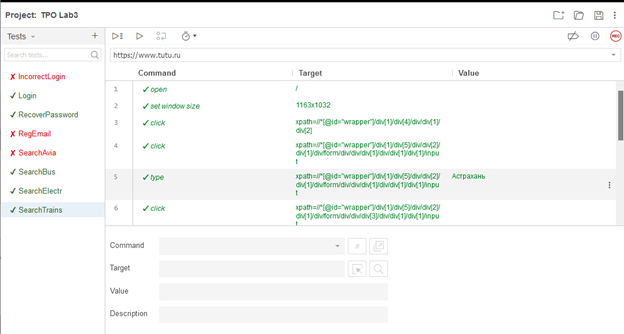

# functional-testing
 
## Задание лабораторной работы
Сформировать варианты использования, разработать на их основе тестовое покрытие и провести функциональное тестирование интерфейса сайта (в соответствии с вариантом).
TuTu.ru - www.tutu.ru/

### Требования к выполнению работы:
1.	Тестовое покрытие должно быть сформировано на основании набора прецедентов использования сайта.
2.	Тестирование должно осуществляться автоматически - с помощью системы автоматизированного тестирования Selenium.
3.	Шаблоны тестов должны формироваться при помощи Selenium IDE и исполняться при помощи Selenium RC в браузерах Firefox и Chrome.
4.	Предполагается, что тестируемый сайт использует динамическую генерацию элементов на странице, т.е. выбор элемента в DOM должен осуществляться не на основании его ID, а с помощью XPath.

## UseCase – диаграмма 

## CheckList тестового покрытия

## Описание тестовых сценариев
Для раздела «Авторизация и регистрация» выбраны наиболее распространённые сценарии – регистрация по email, вход с использованием корректных данных, с использованием некорректных данных и восстановление пароля через email.
Для раздела «Поиск билетов» выбрано конкретное направление и дата, и использовано для тестирования всех типов транспорта. Проверка происходит по элементу на странице со списком результатов.
Стоит добавить, что регистрация и вход через социальную сеть на время выполнение работы на сайте не работают в принципе. 
Тестовые сценарии писались под браузер на движке Chromium, а проверка в браузере Firefox дала сбой на нескольких тестах из-за несовпадения XPath у pop-up окон и ошибок, которые использовались во время тестирования.
Для раздела «Переход на дополнительные сервисы» выбраны сценарии переадресации на дочерние домены сайта, включая билеты на все виды транспорта, кроме поездов, ссылка на мобильное приложение и вакансии.

## Результаты тестирования

По результатам тестирования выявлено только одно несоответствие с функционалом сайта. Все остальные тестовые сценарии завершены успешно.
